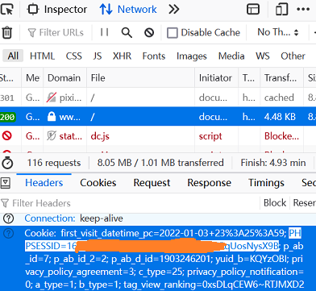

# pixSync

Sync your bookmarked illusts to local disk (WIP)

## Usage

### Get your `refresh token`  by [`get-pixivpy-token`](https://github.com/eggplants/get-pixivpy-token)  
0. Make sure Chrome installed
1. Install `get-pixivpy-token` by `pip install gppt`  
2. `gppt login`, a Chrome window will be opened
3. Enter your pixiv username and password then click login
4. The Chrome window will close automatically, and you will see something like below in your terminal
    ```bash
    [+]: Success!
    access_token: ***
    refresh_token: ***
    expires_in: 3600
    ```

### Get your `PHPSESSID` 
1. Run Chrome or Firefox, open `Web Developer Tools` by press `F12`, switch to `Network` tab
2. Login [pixiv](https://www.pixiv.net)
3. Click any of the sessions that appear
4. Find `PHPSESSID` in the `Cookie` field of `Request Headers`  
   

### Config
1. Rename `config.json.sample` to `config.json` and place your tokens and `PHPSESSID` in it
2. Edit `config.yaml` as needed

### Run
`python main.py`  
For periodic synchronization, please use `crontab` or something

## Functions and todos
### Functions
+ [x] Download **ALL** your bookmarked illusts and mangas (unsupport ugoira)

### WIP
+ [ ] Download only new bookmarked illusts
+ [ ] Automatic rename

### TODOs
+ [ ] Download and transcoding ugoira
+ [ ] Integrate `get-pixivpy-token`
+ [ ] Get `PHPSESSID` automatically by `selenium`

## LICENCE
[WTFPL](https://github.com/Ivanlon30000/pixSync/blob/main/LICENCE.txt)